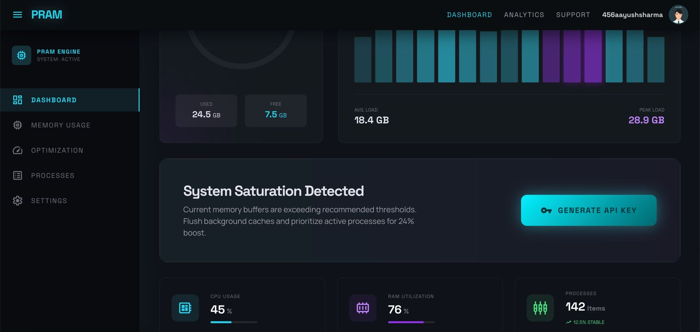
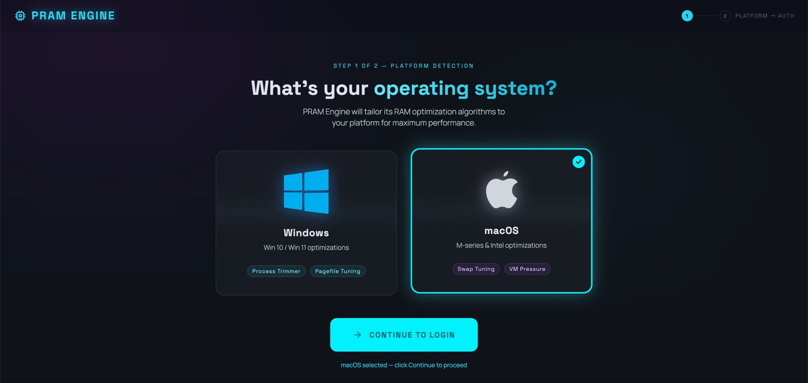
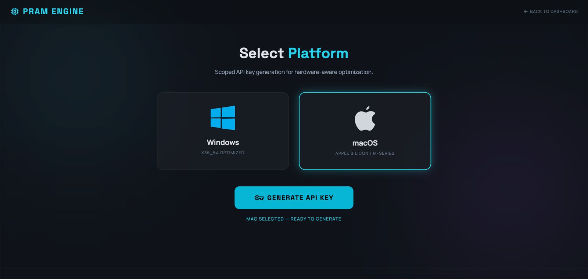
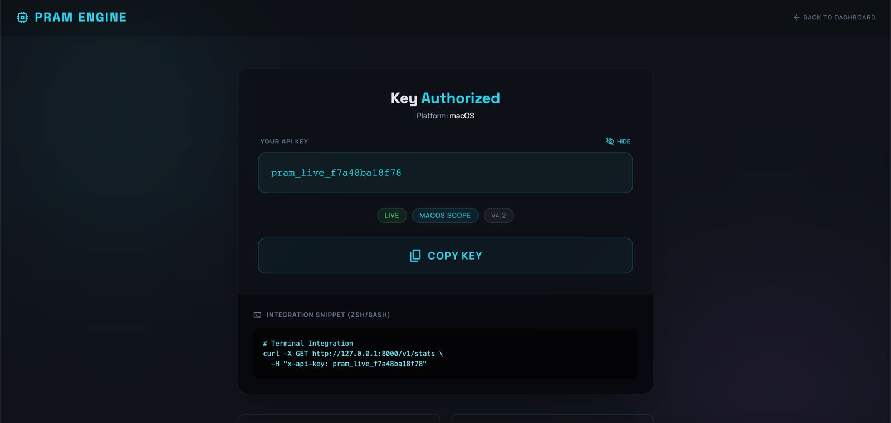
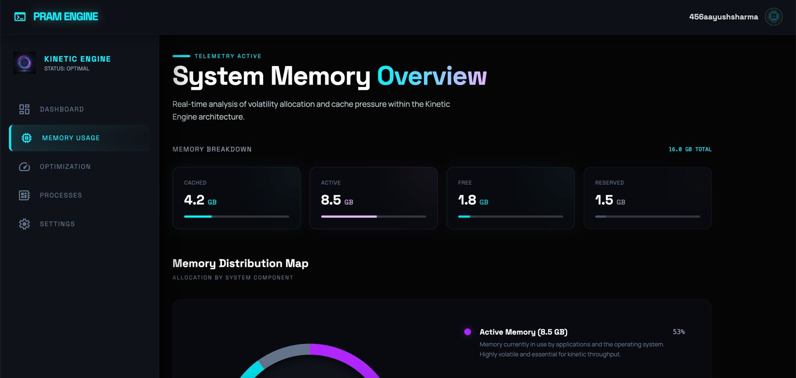
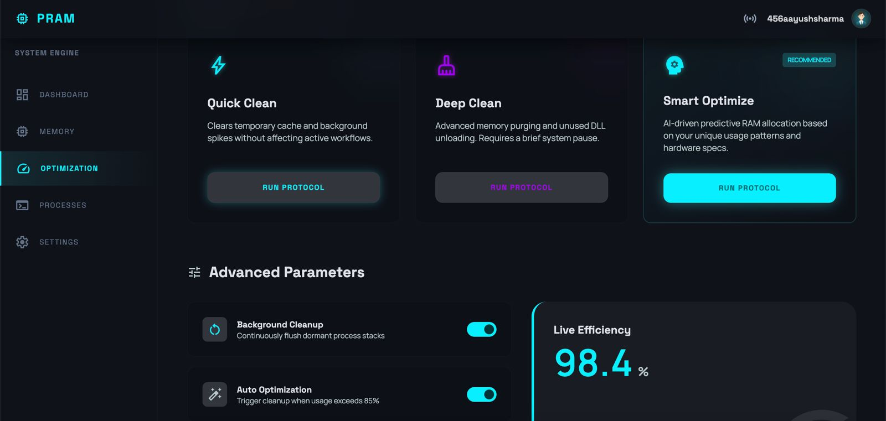
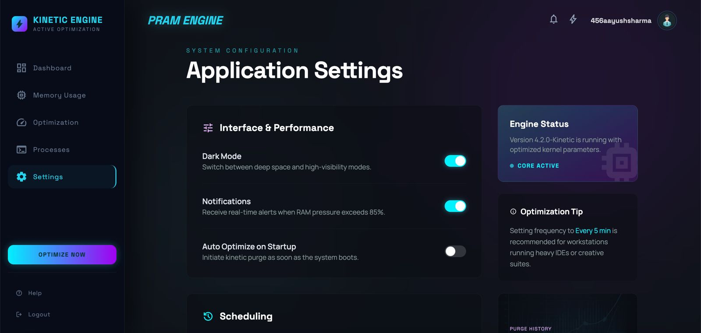
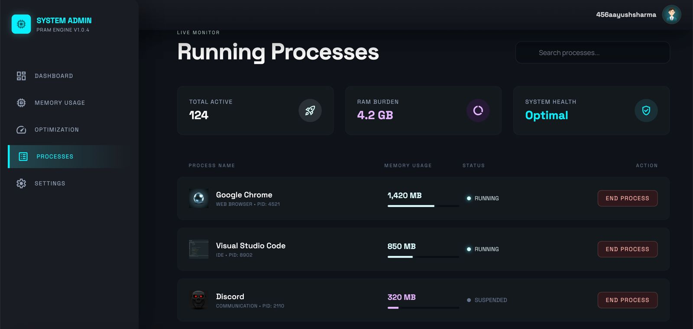
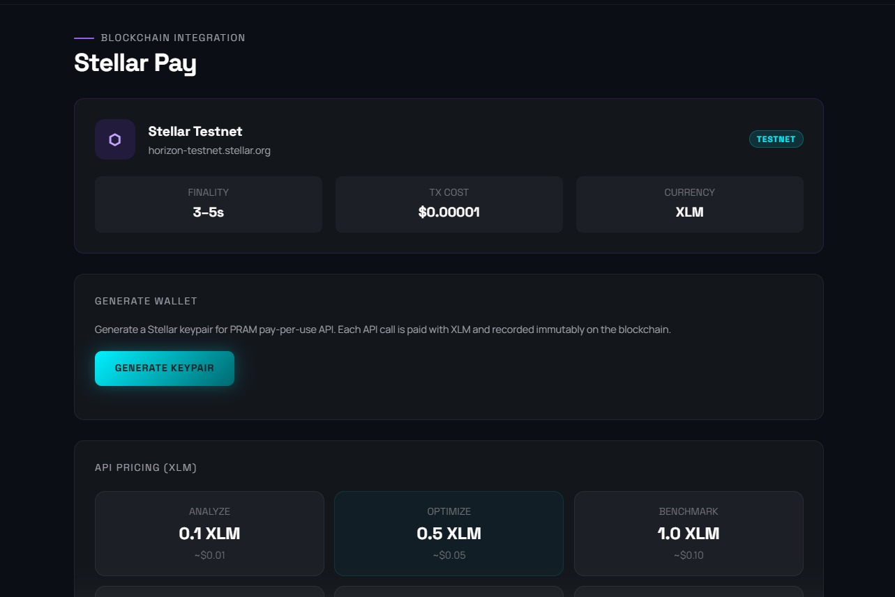
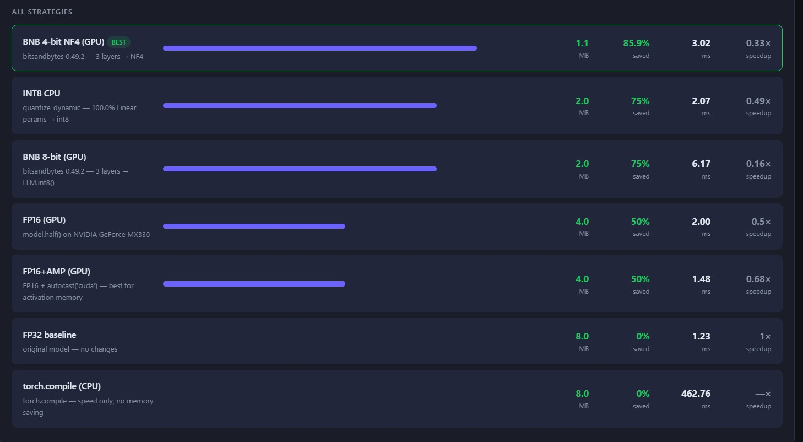

# 🚀 PRAM AI Optimizer

<div align="center">


### Intelligent AI Model Compression & Memory Optimization Engine

Reduce AI model memory usage by **85.9%** through automated quantization, hardware-aware optimization, and deployment-ready inference workflows.

</div>

---

## 🏆 Key Achievement

| Metric | Result |
|----------|----------|
| Original Model Size | 8.0 MB |
| Optimized Model Size | 1.1 MB |
| Memory Reduction | **85.9%** |
| Best Strategy | BNB 4-bit NF4 |

---

## 📖 Overview

PRAM (**Predictive RAM Optimization Engine**) is a hardware-aware AI optimization platform designed to reduce the memory footprint of machine learning models and improve deployment efficiency on resource-constrained systems.

Instead of requiring expensive hardware upgrades, PRAM automatically analyzes available resources and selects the most effective optimization strategy for the target environment.

The platform combines intelligent optimization, quantization, benchmarking, deployment automation, and infrastructure-aware decision-making into a single workflow.

---

## ✨ Features

### 🧠 Hardware-Aware Optimization
- Automatic CPU/GPU Detection
- Dynamic Strategy Selection
- Memory-Aware Execution
- Resource Profiling

### ⚡ Quantization Engine
- BNB 4-bit NF4
- BNB 8-bit
- INT8 Quantization
- FP16 Optimization
- Automatic Mixed Precision (AMP)
- GGUF Conversion

### 📊 Analytics & Benchmarking
- Compression Analysis
- Memory Monitoring
- Performance Benchmarking
- Resource Utilization Tracking

### 🔑 API Platform
- API Key Generation
- Authentication Layer
- SDK Integration
- Usage Tracking

### 💳 Blockchain Integration
- Stellar Payment Support
- Usage Monetization
- Secure Transactions

### 🖥️ Dashboard System
- Memory Analytics
- Optimization Monitoring
- Process Tracking
- Configuration Management

---

## 📸 Screenshots

<table>
<tr>
<td align="center">
<b>Dashboard Overview</b><br>

</td>

<td align="center">
<b>Platform Detection</b><br>

</td>
</tr>

<tr>
<td align="center">
<b>API Key Generation</b><br>

</td>

<td align="center">
<b>API Authorization</b><br>

</td>
</tr>

<tr>
<td align="center">
<b>Memory Analytics</b><br>

</td>

<td align="center">
<b>Optimization Engine</b><br>

</td>
</tr>

<tr>
<td align="center">
<b>Settings Panel</b><br>

</td>

<td align="center">
<b>Process Monitor</b><br>

</td>
</tr>

<tr>
<td align="center">
<b>Stellar Payment</b><br>

</td>

<td align="center">
<b>Quantization Comparison</b><br>

</td>
</tr>
</table>

---

## 🛠️ Technology Stack

### Languages & Frameworks
- Python
- FastAPI
- PyTorch
- Transformers

### Optimization Technologies
- BitsAndBytes
- GGUF
- Quantization
- Mixed Precision
- Memory Mapping
- Model Chunking

### Infrastructure
- REST APIs
- SDK Integration
- SQLite
- Stellar SDK

---

## 📈 Performance Results

| Optimization Method | Model Size | Reduction |
|--------------------|------------|------------|
| FP32 Baseline | 8.0 MB | 0% |
| FP16 | 4.0 MB | 50% |
| FP16 + AMP | 4.0 MB | 50% |
| INT8 | 2.0 MB | 75% |
| BNB 8-bit | 2.0 MB | 75% |
| BNB 4-bit NF4 | 1.1 MB | **85.9%** |

---

## 📂 Project Structure

```text
PRAM-AI-Optimizer/
│
├── screenshots/
├── optimizer/
├── hardware/
├── model/
│
├── api_service.py
├── pram_sdk.py
├── run.py
├── run_auto.py
├── run_gguf.py
├── run_optimizer.py
│
├── requirements.txt
├── README.md
└── .gitignore
```

---

## 🚀 Getting Started

### Clone Repository

```bash
git clone https://github.com/ShivamKapoor-py/PRAM-AI-Optimizer.git

cd PRAM-AI-Optimizer
```

### Install Dependencies

```bash
pip install -r requirements.txt
```

### Run Optimizer

```bash
python run_optimizer.py
```

### Run Automatic Optimization

```bash
python run_auto.py
```

### Run GGUF Optimization

```bash
python run_gguf.py
```

---

## 🎯 Use Cases

- AI Model Deployment
- Edge AI Systems
- Memory-Constrained Devices
- Startup Infrastructure Optimization
- MLOps Pipelines
- Cost-Efficient AI Deployment
- On-Device Inference

---

## 🔮 Roadmap

- ONNX Runtime Integration
- TensorRT Optimization
- Multi-GPU Optimization
- Edge Device Benchmarking
- Kubernetes Deployment
- Distributed Inference
- Cloud Cost Prediction
- LLM-Specific Compression Pipelines

---

## 👨‍💻 Author

**Shivam Kapoor**  
B.Tech Computer Science Engineering  
Bennett University

### Focus Areas
- Artificial Intelligence
- Machine Learning
- MLOps
- AI Infrastructure
- Systems Optimization
- Edge AI

---

## ⭐ Support

If you found this project useful:

⭐ Star the Repository

🍴 Fork the Repository

🚀 Contribute to Future Development

💡 Share Feedback

---

<div align="center">

### Optimize • Compress • Deploy

# PRAM AI Optimizer

Building Efficient AI for Resource-Constrained Systems

</div>
